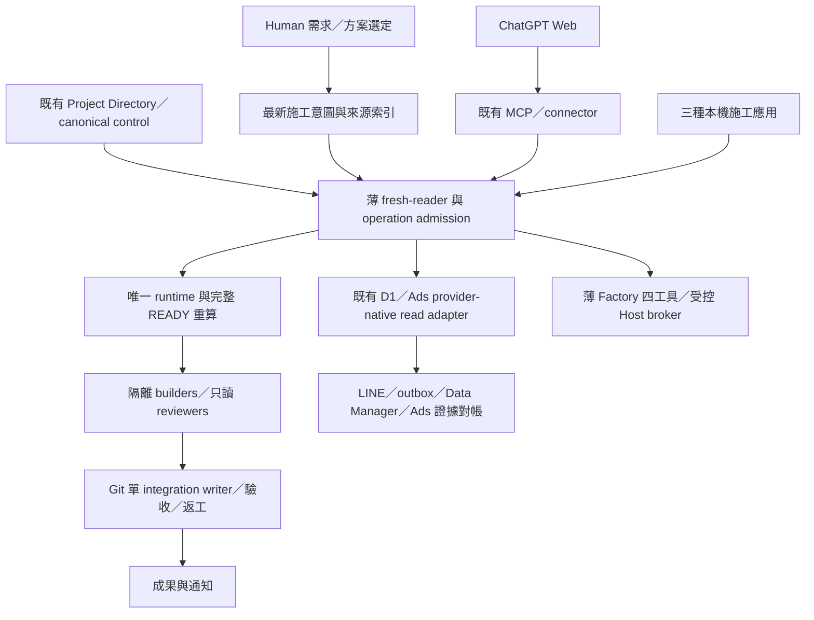

# VNEXT5.2 統一施工規格｜V52-INTEGRATED-20261003-R1

## 最優先功能

1. 修正「缺一條 route 就全部停工」、Session／Goal／generation rollover 造成的純 transport deny；保留實質 side-effect guards。
2. 讓 Web、Codex、Antigravity、OpenCode 取得同一份最新施工意圖、來源與工作收據。canonical、施工架構、installed runtime 分欄。
3. 恢復廣告轉換追蹤的日期限定 D1／Ads 讀取、證據對帳、診斷與已授權候選施工；實際 MCP route 必須驗收。
4. 以既有 native harness、Git worktree、OS isolation 和唯一選定 durable runtime 完成工廠全流程。成熟元件採用以真正淨刪碼與故障資格化為準。

## 分層

共用施工入口只索引 Human 要求與 evidence，不獲取 execution owner。發布它不改 CP200、不 revoke gen5、不創 gen10、不 dispatch、不安裝 Host candidate。正式 control cutover 由整合者沿 authorized protected CAS／PR 流程執行，owner generation／lease 在實際 selection 才分配。

## MCP 的兩個用途

- Web 沒有本機 terminal：MCP 是它觸達受控工具、Host、Project 狀態與收據的橋接。Factory 保持四 public tools，host_powershell script capability 不退化。
- Ads／D1 是業務 provider：優先既有合格 provider-native engine／connector。MCP 可提供 Web 操作入口，但不強制所有雲端 API 繞 SYSTEM，也不另造第二 gateway。

固定只讀 projection 不需要 mutation fence。任意 script 不能靠名稱或 regex 被認定只讀；Host target、OS caller、bounds、STOP、unknown-effect readback、backend CAS、Production Human gate 保留。

## 工廠完整功能

Human 一段命令→真實研究→一般三種實質不同方案與推薦→Human 選定 exact plan→架構與接口／slice DAG→不重疊 builders 異步施工→獨立 exact-artifact review→Git integration→功能／安全驗收→基於 finding 的有界返工→通知交付。

保留原 59-operation union、64 cases、REV2 與 30 個產品要求／28 個產品回歸。只有一次完整 READY truth，不因新文件新增同義操作；有效 evidence 精確重用。核心／已 admitted business／三品牌／重啟／UI closed／soak 全部適用項未完成，不得宣稱 Mission closure。

## 最少自製責任

保留薄 admission／reconciliation、native identity/cancel、provider CAS/readback、slice/review/integration/evidence seam。成熟 SDK／CLI／OS／Git 功能能替換者不重寫。

Restate 仍是一次有界整層替換候選，先解 MCP／業務；沿已剩餘 D01 budget，最多 8 effective engineering hours、一個 spike。license／Linux deployment／SDK compatibility／durability 實測合格才替換。DBOS 只在已有合格 PostgreSQL 且 Restate 精確受阻才備選，不平行架兩個 engine。舊 active loop／journal 替換後退休，歷史保留；任一時刻一個 dispatcher。

工程目標 generic custom glue 淨減少 50%，不是當前已刪碼、不是權限 gate。禁止額外 Jev、agent bus、mailbox、routing DB、全時 Architect 或第二 AI 批准者。Luna Max 保持 Human 指定；簡單判斷用現有 deterministic rules。

## 完成標準

共用入口兩個獨立 reader 已可讀，不等於新 Session 真接續。Factory tool health 不等於 Ads readback。source／local／structural／semantic／live／system／Production 分別驗收。README、ZIP 或 Prompt 絕不自動變 PASS。
