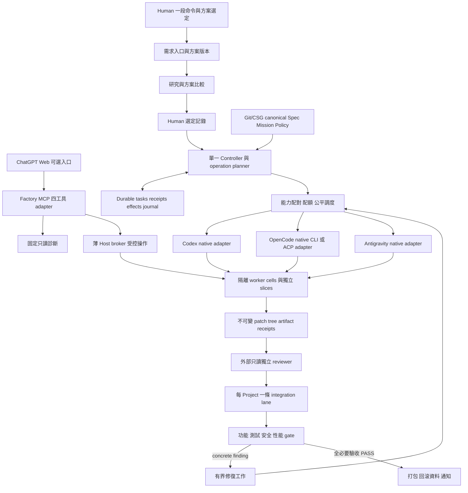
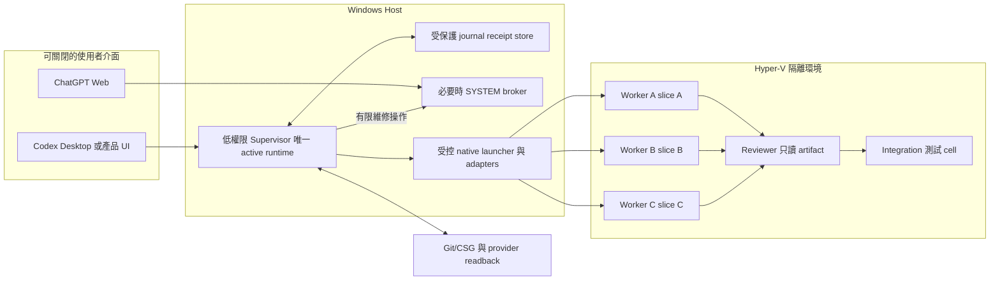
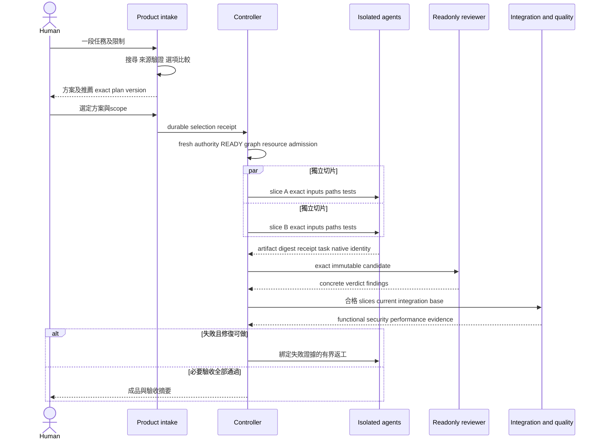

# VNEXT5.2 最終產品功能與架構設計

## 1. 原規格的缺口與本增補目的

原最佳化規格與 REV2 有治理、隔離、receipt、恢復及 phase DAG，但沒有完整描述 Human 所要求的產品入口、研究方案、人類選定、三家 agent 分工、整合返工及最終交付。phase DAG 不能取代產品 component/deployment/sequence 設計。這是先前規格交付的缺口。

本文件把這些需求明確化，與原 64 acceptance 及 REV2 回歸並行。治理基礎完成不等於產品完成；新增要求沒有實作／live proof 就是 NOT_ACCEPTED。沿用 VNEXT5.2，不重命名 Mission 或重置已完成工作。

## 2. 最終使用者流程

Human 輸入一段自然語言命令，例如「建立一套可離線使用的庫存系統，支援掃碼、匯出與權限控管」。系統抽取功能、限制、資料、成本與交付條件，主動研究有日期／來源的可行方案。通常提出至少三個實質不同選項及推薦；若只有兩個可行方案，說明第三方案被淘汰的事實，不杜撰選項。

Human 只需確認所選 solution/version/scope/cost envelope。系統在該範圍自動完成詳細設計、切片、agent 分派、測試、審查、整合與有界返工。普通可逆施工、重開 session、換合格 agent、checkpoint rollover 不重新詢問。新增 Production、支出、身份或重大信任擴張才使用既定 reserved gate。

完成通知含成品位置、使用方式、exact artifact identity、驗收與安全摘要、已知限制；未通過必須回報未通過，不能由 agent 自述「完成」觸發成功通知。

## 3. 元件架構圖

MCP 是 adapter／client access surface，不是唯一 executor transport，也不是 core scheduler。Codex local construction 可經 shell、native CLI、經驗收的 IPC/backend route；MCP 是否掛在某 Session 不決定這些能力是否存在。

Factory MCP 仍只有 factory_status、worker_prepare、worker_start、host_powershell。factory_status 保持固定用途只讀；host_powershell 保留受控 script capability，不藉本增補擴大 Production scope。新需求入口使用現有 UI/native command gateway 或受控 application API，不把 factory_status 偷改成 create-Mission，不增第五個 Factory MCP public tool。ChatGPT Web 的完整 conversational intake 若未建置，不得用四工具清單冒充已完成。

## 4. 部署與信任邊界

- coding 不在 SYSTEM broker 中執行。VM/worktree/cell 身分、目錄、CPU/RAM/磁碟、網路 egress 及生命周期均需實測。
- worktree 隔離 Git bytes，不能隔離 OS/process/network/secret。VM 內多 cells 若共享可寫目錄，仍不能叫互不干擾。
- worker provider-write credentials=0；控制平面寫權限留在可信 publisher/controller。模型 inference auth 另按最小使用 scope 管理，不能複製 Host 全部 profile/auth 進 worker。
- 外部網頁、repo、插件、模型輸出均為不受信資料，不得更改 authority 或放寬工具權限。
- 即使 UI 與 GPT Web 消失，Supervisor/journal/合格 native workers 繼續。Codex Goal 是施工協助，不能作為產品持久執行引擎。
- 單 Windows Host 的 reboot recovery 不等於高可用；本版承諾範圍為原 spec 單 Host recovery，不能宣稱無停機或跨區 HA。

## 5. 端到端 sequence

## 6. 工作與資料契約

最低物件：Request、ResearchSource、OptionSet、ApprovedPlan、ArchitectureDecision、SliceContract、TaskAttempt、NativeJobIdentity、ArtifactManifest、ReviewVerdict、IntegrationCandidate、AcceptanceReceipt、EffectLedger、DeliveryReceipt。

所有 task binding 使用 project/mission/plan digest/task/attempt epoch/input tree。runtime execution owner 與 inert candidate identity 分開；選定 transaction 才依 fresh canonical prestate 和 consumed identities 分配 owner/lease。本地 UI 或 branch 可讀不得燒 execution generation。

SliceContract 明列接口、allowed paths、excluded shared resources、exact base、output schema、build/test commands、time/resource limits、acceptance IDs。Controller 做 overlap detection；shared lockfile/schema/contracts 的變更先拆 integration-owned unit 或取得 mutation-key lease。agent 不得自行 merge、擴 path scope 或改測試判定基線。

review 證據必須綁 exact tree/head、review invocation、readonly boundary 與 findings resolution。integration 時以當前合格 base 重讀；如 byte identity 改變，只有受影響 target verdict 失效。source、promotion packet、observation evidence 分 branch；避免 self-referential SHA 更新迴圈。

## 7. 有界自我完善

系統遇到失敗先保存具體 finding，分類 code defect/environment/auth/quota/ambiguous effect。每類有可重算 attempt limit、backoff、替代合格 route；失敗不代表 Human 必須重貼 prompt。沒有新 bytes/finding/authority/capability delta，不重做相同 verifier/review/action。

優化提案以離線 benchmark 或 held-out task set 證明，再形成受控 source candidate；不能線上修改 safety oracle、把 failing tests 刪掉或讓 Policy 更嚴直到永遠不能做事。修復重試耗盡只停 exact task，其他 READY 繼續；完整 queue 沒有合法工作才 durable WAITING。待事件改變自動 re-entry，但未安裝合格 wakeup/runtime 前不能宣稱已有自動續工。

## 8. 施工次序

1. 修 F01 native preflight／adapter與現有 D02 facts；保存現有通過證據。
2. source 建置產品 intake、研究選項、selection schema、slice contract；不依賴未來 MCP install。
3. 一條合格 agent 的小型真實 software vertical slice，串起審查、整合、返工、交付。
4. 補 OpenCode/Antigravity 各自 route acceptance，證三品牌 N3 分片整合；不能拖延第一條可做 slice。
5. 依原契約完成正式 cutover、survival/soak、security與性能測量，再做完整產品 closure。

實作採既有成熟 runtime/harness/OS service primitive 的最小 adapter。先依 D01 selected decision；本增補不指定再加 Restate/LangGraph/另一 scheduler，不要求重寫各廠商 harness。
