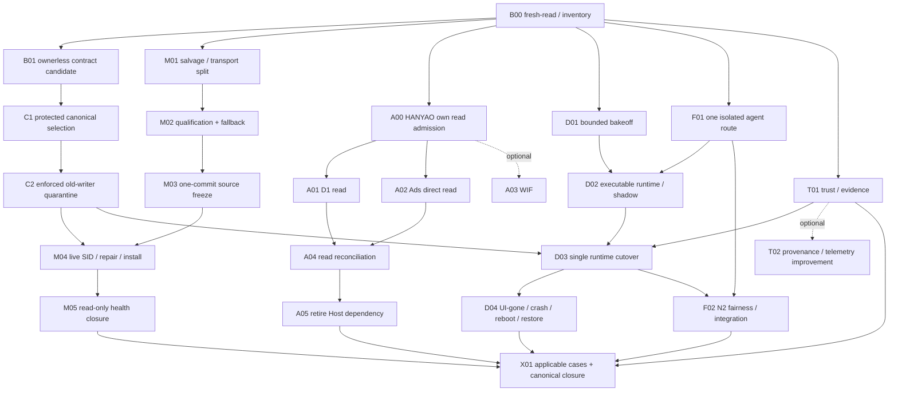

# VNEXT5.2 全自動軟體工廠｜最佳化詳細施工規格

版本：VNEXT5.2；文件修訂：OPTIMIZED-20261002；目標 executor：GPT-6 Luna / max。
文件角色：待 Human 採用的施工契約。此次交付只產生文件與唯讀證據，未做 canonical cutover、owner revoke、Host install 或 Production。
本文件採用後取代原 V5.2 規格中與本文件衝突的設計；原 R2、ASTRA 報告、舊聊天只作歷史／根因／source donor。
此修訂不另開 V5.2-R1/R2 Mission。可修文件勘誤；重大 scope、成本、信任或 Production 變更另依 Human authority。

## 0. 執行摘要與可交付結果

施工目標是讓工廠接收已授權任務後，自行讀取 canonical、排出 READY 工作、隔離建置、獨立審查、驗證、整合、讀回結果；UI 關閉、agent 退出、quota 或某一路徑故障不再要求 Human 搬運進度。

保留：Git/CSG 唯一 Mission authority、Hyper-V 正常 coding 邊界、四個 Factory MCP public tools、必要 OS caller／Host／STOP／effect／Production 邊界。
優先替換：共用 broker 的 Project／Session metadata deny、自製 tunnel 推論、Windows provider 中繼、重複 agent wire、重複 scheduler/retry/wait。
保留 upstream 做不到的最小 Project acceptance、backend fence、external-effect readback 接縫。

分別交付以下 release points，不能等待整座工廠完美才釋放可用能力：

| Release point | 結果 | 不依賴 |
|---|---|---|
| RP0 | 現況與 V5.2 authority candidate 可 provider-addressable 讀取 | gen5 process death、live install、全部 reviewer quota |
| RP1 | 已獲 HANYAO read scope 的 D1/Ads 唯讀 lane 可用 | Factory MCP、SYSTEM、WIF 完成、24×7 |
| RP2 | Factory MCP 共享、安全、四工具 capability parity live PASS | durable runtime 選型、scale、全部歷史 orphan 清零 |
| RP3 | 一個真實任務從 command 到 receipt/notification；crash 可恢復 | N4/N8、多 Host、所有可選 OSS |
| RP4 | 24×7 脫離 UI；多任務公平調度；故障與 restore 驗收 | Production 自動批准 |
| RP5 | HANYAO Production-ready packet | Factory Mission 不授予 Ads Production |

完成某 release point 只完成該能力，不結束仍 ACTIVE 的整體 Mission。文件發布、測試綠燈、PR merge 均不能代替上述實際結果。

## 1. Authority、採用與 Human gate

### 1.1 當前請求與未來執行

本輪 Human 要求「修正優化並生成接手檔案」，因此五份附件中的執行命令在本輪被當作待修正材料。不能由附件自行推導已批准 supersession/revoke。

新 Session 收到 Human 明確「採用並執行本接手包」後，在既有／該次授權內開始可逆 pre-Production 施工，建立 durable V5.2 authority candidate，依受保護流程完成選定。
不為普通 source work、已授權可逆維修、重開 Session、checkpoint rollover 重問批准。
只有真的越過下列保留邊界、或既有授權證據不足以涵蓋具體副作用，才提出一次具體可審閱的請求：

- Production／廣告投放、預算、真實 conversion upload、Production deployment；
- 新付費服務／付費 fallback／超出已確認 entitlement；
- 法律簽署、身份代辦、需要 Human 的 OAuth/MFA；
- 重大不可逆信任擴大，包括 protected trust-root 的保留更新程序；
- 無法解決且牽涉該目標的 ambiguous external effect。

不能把「新 Mission 候選尚未選定」變成所有唯讀、離線建置、候選測試的前置。不能把上述 gate 擴張成每個 run/task/session 的批准。

### 1.2 Authority 不變條件

- Human 最新明確授權決定 intent/scope；canonical 說明已 durable 選定的 Project 狀態。
- 規格候選、Git PR body、report、Goal、mailbox、週報、OTel 都不是第二個 current pointer。
- Git/CSG 只管 Spec/Mission/Policy、被選定 acceptance、task/owner/effects/control transition。
- Runtime journal 是必要執行紀錄，可以有自身 datastore；不能授權新的 Mission、Production 或 owner。
- Runtime 與 canonical 不一致時，先禁止新衝突 mutation，讀回在途 effect。不能刪 runtime journal 就假裝外部工作不存在。
- current selection 只能透過 repo 真正支持的 PR／ruleset／CAS 或 backend serializer；不得 force canonical。
- 要修改 trust-root/workflow，先讀它的真實更新程序。這是獨立 lane，不能偷放 source／promotion PR。

### 1.3 Policy guard 必須可追溯

每個硬 deny 只需留下：scope、authority source、阻止的實際副作用、反例、解除條件。
不得發明新 Human gate 作為避免研究不確定性的手段。
Policy 比 Human Spec 更嚴時，標出差異；沒有相應 authority 不得使其成為 hard gate。安全缺陷不能以「刪 gate」之名繞過；應縮到受影響資源／lane 並修復。

## 2. 本輪核對的真實基線

時間：2026-10-02 約 14:20 UTC（22:20 Asia/Taipei）。詳見 evidence/provider-snapshot.json。
這是觀察快照，不是永久 current；新 Session 必須再讀。PR body 的測試宣告與 job API live readback 分開。

| 項目 | 本輪 readback |
|---|---|
| Repository | PT-Original-Point/ptysd-vnext42-governance-sandbox；ID 1352411536；public |
| Directory record | directory/projects/CHATGPT_GLOBAL_SKILL_GOVERNANCE.json；BOUND；revision 5 |
| Directory locator | refs/heads/v45/factory-control / governance/csg/current.json |
| Canonical control head | d39486601d851e31256852a24e9c1393b9046fe5 |
| Current selection | CP200；VNEXT5.1-R2；Mission ACTIVE |
| Mission / Policy | 20260930T104733+0800 / 20260930T104733+0800-EP80 |
| Run / attempt | V51-R2-001；RUNNING；R2-02；attempt 002；epoch 2 |
| Canonical gen5 | lease expired；仍 STALE_EXECUTION_OWNER_CANDIDATE；未 revoke |
| CP200 effects / jobs | unresolved_effect_refs=[]；active_job_refs=[]；不是全域 process 掃描 |
| #381 | e16cd05e821572061321f807841ae0145ff69bc1；one commit；30 paths；非 Draft；未 merge |
| #377 | 491493627bd6ffcd51b0cd9287ab2cb465fbf9ee；one commit；12 paths；非 Draft；未 merge |
| #383 | 3b328c9ae8dbf107cbe581914ecae6773ab8f2bf；one commit；18 paths；Draft；未 merge |
| HANYAO #88 | 7cd87cb0f69b5586719c1265828df20879b28bf2；Draft；未 merge；observability only |
| Local Goal | paused；API 本身沒有 resume/set-active；不是 Mission authority |

PR381 package 為 @ptysd/factory-mcp 0.2.3、@modelcontextprotocol/server 2.0.0。
本輪直接讀到 trusted-caller-boundary.ps1（blob e343cccd44e344c930981a58a19f2f3332eb0d27）仍硬寫治理 Project，並以 REQUEST_PROJECT_MISMATCH 拒絕其他 Project。這是具體 source defect，可重開原 source freeze 的精確範圍。
Host exact target 是必要邊界；應從受信 install configuration 取得，不能藉「Project-neutral」取消 Host binding。

三個 PR body 報告各 exact-head structural PASS，semantic pending，bounded-driver skipped。
本輪 generic GitHub fetch 不接受 actions/jobs URL，因此沒有把 PR body 說成重新驗證 job 結果。下一個需要此 gate 的 executor 用真正 job/check API 讀回，不能因 connector 限制再創 verifier。

先前 Host/VM/tunnel/live count 是附件歷史快照，本輪未重新取得 live Factory MCP observation。不能宣稱 Host 現在已安裝 candidate、current version=0.2.3、orphan 一定仍 5。
目前本地 21-file Supervisor donor 仍缺 bin/host-supervisor.mjs、packaged runtime、真實 dispatcher；88/88 是舊 local evidence，不能稱 24×7 PASS。

## 3. Fresh-read 與復原順序

首次、context compaction、external wake 或 material delta 後：

1. exact Project Directory record →固定 repository identity、binding、control locator。
2. fresh control ref OID → current pointer → pointer 指定 checkpoint；檢查 schema、Project、binding、digest。
3. checkpoint 的 immutable Mission／Policy／run anchor；區分 selected immutable snapshot 和 mutable candidate。
4. current task/attempt/owner、STOP、unresolved effects、已確認 receipts。
5. 需要時才查 source PR/check/review、Host/component/provider/session 的新觀察。
6. 對已保存完成證據判定可重用；排 READY、WAITING、BLOCKED_SCOPE，再選 work。

不要每個 filesystem edit 都重讀全 provider，也不要等待整份 global observation 才做 source work。
mutation commit/dispatch 前一定再讀其 exact prestate；read-only decision 的 observation TTL 按 operation 設定。
Directory branch 裡 legacy governance/csg/current.json 曾是 CP10，不能冒充 Directory record。
JSON duplicate key 要拒絕；Git SHA-1 輸入要求 lowercase 40-hex，不 trimming/修復 malformed evidence；SHA256 要 lowercase 64-hex。若 repo 將來用 SHA256 object format，先明確版本化 schema，不能靜默接受其他長度。
raw bytes hash、Git blob OID、canonical payload digest 各有算法/encoding，不能混用或靠重新序列化掩蓋原文差異。

## 4. Old-owner 解耦與真正 fence

四個狀態分開記：

OWNER_AUTHORITY_VALIDITY、EXECUTOR_PROCESS_EXISTENCE、ACTIVE_FACTORY_JOB、EXTERNAL_EFFECT_STATUS。

gen5 lease expired 表示其 lease authority 已逾期；不證明 process dead，也不能推導所有外部 credentials 都失效。
Human supersession intent 不等於 canonical revoke 已提交，更不等於 provider credential 已撤銷。

分三步：

1. SOURCE/READ：非衝突 source、離線測試、已授權 provider read 可先做；不用證 old process death。
2. CONTROL：Human 採用後，fresh prestate → ownerless V5.2 rebase candidate →受保護／CAS 選定 →same-source readback；舊 run 保留歷史並被正式標 superseded。若選定被 ruleset 阻止，park publication，繼續 lawful candidate/read lanes。
3. SHARED MUTATION：列出 old executor 可寫的 repo/Host/provider 範圍與 credential holder；驗證 enforced fence／single authoritative publisher／必要撤銷。無法證明 old write 被阻擋時，park exact conflicting mutation，不能靠文檔 revoke 放行。

STOP 必須能阻止新 dispatch；在途 effect 仍要 readback。old process 即使活著，backend 拒絕舊 owner 的寫才算 quarantine PASS。
Runtime mutex 只防 runtime 內競爭，不替代跨 executor/backend fencing。
不在同一 transition 同時 revoke old owner 和 dispatch next worker。
readback 前不能給下一 executor 預支 authority。

## 5. Candidate identity 與 owner allocation

每個 inert candidate：

owner=null；owner_generation=null；lease_until=null；execution_owner_allocated=false。
candidate_instance_id 唯一、durable，不是 execution owner generation。
proposed_owner_generation_policy=NEXT_AVAILABLE_AT_PROMOTION。
lease_duration_seconds 配置有限 TTL；不能寫 future absolute expiry 當 active lease。

當真正選定 execution owner 的 CAS：
fresh canonical prestate + fresh consumed execution identities → allocation → recorded_at=selection time → lease starts at/after recorded_at → lease_until>recorded_at → canonical write →same-source readback。
control-only rebase 可以保持 ownerless；只有準備 actual execution claim 的 transaction 才分配 owner。
new generation > current canonical generation，且不能撞 durably consumed identity。
歷史 gen6–gen9 readable candidate labels 不自動算 consumed；保留分類證據。不得無理由創 gen10/11。

Git promotion 沒有現成跨-ref ACID。先讀 repo 實際 CAS／serializer／受保護 publisher 契約；若不存在，建立最小 selection adapter 或 park 該 mutation，不能用「PR merge」文字假裝 runtime transaction 完成。
執行 owner 分配與不可知的 merge time 不能事先寫死。pointer selection 與 owner claim 可以是兩個獨立、可讀回 transition。

## 6. PR、source freeze、promotion 的施工紀律

source-only、runtime-only、control/promotion packet 三種 responsibility 分開：

- #381：Factory MCP source donor。只 tools/csg/factory-mcp/**；不移 current pointer。
- #377：main runtime donor。不能把 src/core.ts 偷放 control PR。
- #383：R2 governance candidate/test donor。不可未審選定便當 V5.2 current。
- #342/#378/#382：歷史 composite／observation／promotion 證據，不因舊 SHA 而重建。
- V5.2 source changes 要有 concrete defect／需求差異清單，不能 cosmetic rename 重開。

一個 logical source 候選：已知 findings 先 local 修完 →fresh exact target base →clean rebuild →完整最終 bytes →ONE commit →parent==base →local qualification →讀 remote expected head →force-with-lease 更新候選一次 →exact-head structural verifier 一次 →semantic review →freeze。
不 push 每個 fix，不在 known multicommit DIRECT_PARENT mismatch 上耗 verifier。
force-with-lease 僅候選分支且明確 expected remoteOID；CAS mismatch 先讀差異，不能裸 force。canonical 永不 force。
若 repo 現在允許不同 topology，讀真契約；不能靠擴 allowlist／改 trust-root 讓本候選過關。
root package.json outside canonical allowlist；candidate tests 直接執行，不為接線改根 package。

freeze 後 source byte 改動才使其 exact-target verdict 失效。測試/packet/歷史 metadata 變動不自動重寫 source。
external base 變動只 rebase 受影響 lane；exact artifact/local byte evidence 仍可 reuse，structural parent verdict 需新 target。
known-source defect 才重開 freeze。現在具體範圍是 Project hardcode、完整 caller/security 邊界、qualified 依賴相容；不夾帶 unrelated cleanup。

promotion packet 在 source/runtime 已 freeze 後建立，引用其 head/tree/blob，不包含自己的 HEAD。
自身 commit SHA 只寫在提交後 external readback；不能在同 commit 內用自 SHA 解決 binding。
需要下游更新 source binding 時，一次完成 source freeze→runtime rebuild→packet rebuild；禁止三條 PR 互相追 SHA。

## 7. Shared Factory MCP security contract

### 7.1 責任切割

可信 Project dispatcher／MCP auth-adapter：驗證 request 對應 Human scope、STOP、Project/Host/target、operation class、Production 權限、effect 衝突。
transport/broker：驗 OS caller、確切 Host、request integrity、大小／timeout／concurrency、原子 claim、receipt。
provider publisher：保管 write credential、驗 CAS/fence 與 same-source effect。
worker：不能碰 queue/admin/provider write secrets。

Project ID 是 routing/audit，不能 broker 硬 code 治理 Project；但它不是自行填了就得到權限的證明。
authenticated remote caller 與 Task SID 要各自驗證：SID 只證哪個 local task 寫 queue，不證 MCP 使用者的 Project authorization。
必須確保只有受信 dispatcher 能生成 privileged request；不能讓任意 worker 走合法 task 就獲 SYSTEM。

### 7.2 Metadata 與真正 deny

不因 Mission/checkpoint/run/task/attempt/session/PR/review/Goal 文字變更而 transport deny。
runId 等仍有型別／長度／encoding 驗證，仍記 receipt；不能回退 pattern 白名單當 authority。
generation 在 execution/publisher fence 中有效，在 transport 身份中不是 permission secret。
remove PROJECT_MISMATCH 不等於 remove all Project authority／credential 隔離。

保留 wrongHost、untrusted caller、reparse、tamper、STOP、bounds、same-targetunknown/conflict、未授權 Production deny。
不同 Project 共享 Host resource 需 declared mutation_scope lock；不共享資源的 lane 可並行。

### 7.3 四個公開 tools

| tool | 語義／最低正向 | 必要負向／邊界 |
|---|---|---|
| factory_status | 無任意 script/path；固定 read-only diagnostics、owner projection、native health observation | 無寫 Host、無启动 MCP child、無任意 URL 探测；missing/stale truth 標 UNKNOWN |
| worker_prepare | 按已授權 manifest 準備 exact VM/cell，有限 timeout/resource | 不任意 Host path／任意 credential，不因 prepare 授權 Production |
| worker_start | 每 task 單 execution owner、bounded cell、durablejob/receipt | duplicate／STOP／同 targetunknown 阻止 dispatch，不能用 queued 冒 executing |
| host_powershell | donor v0.2.1 完整 script-capable SYSTEM broker：runId/taskId/attemptId/attemptEpoch/script/timeoutSeconds | timeout1..300、boundedstdout/stderr/truncation、script/outputhash、durable receipt；caller/target/scope 仍驗 |

公開 schema 是否維持 6 欄位要以 installed baseline 與 client 相容性驗證；internal project/target authority 由受信 routing context 取得，不能要求 Human 每次額外批准。
不新增第五 public tool。fix/repair 用既有固定工具或 installer 內部入口，不將內部 repair 公開成任意 SYSTEM 工具。

### 7.4 SYSTEM arbitrary script 的誠實限制

production=false 是 metadata，不能證 script 不改 Production。
可信 controller 與 OS privilege 本身是信任邊界；不用 regex 聲稱能判斷所有 PowerShell 語義。
Host maintenance 身份不持 Google/Cloudflare/business write credential；無 worker-controlledpayload 進 privilegedqueue。
需要限定 Host script 時使用已知維修模板／exactpayload digest 與 target 檢查；script-capable 能力仍保留於 Human 已授權 trustedcontroller route。
不把 host_powershell 功能靜默降成 unconditionalNOT_QUALIFIED，也不為保 capability 而開放不受信 caller。

## 8. OS trusted caller、queue 與 repair

採 Task/Service unique SID，優先 salvage #381。TaskSID 必須由 full task path 取得並在 live token 驗，不靠 friendly name 推算。
Microsoft 說明 TaskSID 與 ProcessTokenSidType 的關係；這是候選安全 primitive，不是已取得 liveproof。[Microsoft Task Security Hardening](https://learn.microsoft.com/en-us/windows/win32/taskschd/task-security-hardening)

最低 live 矩陣：

- exacttask 及 stdiochild 有 expectedTaskSID；taskconfiguration／binary 不可被 lowpriv caller 改。
- genericNetworkService、wrongtask、interactiveworker 不能 create/modifyprivilegedrequest。
- inbox/outbox 只給所需 SID 權限；processing/state 僅 SYSTEM/Admin。
- 不接受 duplicateJSONkeys、oversize、reparse、owner/ACL 漂移。
- claim 後 payload 不可被原 caller 替換；read/hash/claim/execute 避免 TOCTOU，不能只 rename 便稱 immutable。
- 多 Project request 被正確 upperauthority 處理；falseProject 與 wrongHost 不獲更大 scope。
- token capture、DACL/owner、negative injection 均有 exactHost/boot/config/source 證據。

non-circularrepair 入口不能依賴 brokenMCP；既有 authorizedlocalprivilegedroute／fixedrepair task 其一。
manifest 含 exactfiles/hash/allowlist/prestate/backup ownership/expectedtaskconfig。
repair 驗 bundlesignature/可信 source，applyexactfiles，restartexactcomponent，readback，boundedcanary，必要時 rollbackowned delta。
無 admin route 時 parkliveRepair，完成 bundle／source／parse／test，不索要 Human 重發普通 prompt。
不得改 ExecutionPolicy、關 Defender、開 globalACL 或把 worker 升 Admin 來取巧。
repair 通過後縮為固定 installer recovery 入口；先有 testedrollback 才刪。
rollback 不能刪 preexisting helper／task／secret 或覆寫 otherProjectasset。

## 9. Dependency 與 upstream 採用

本輪官方 release 頁確認 tunnel v0.0.15、MCP server 2.2.0 存在；不是「安裝即 qualified」。
SDK package 版本與 wire protocol 版本分開；不得寫 MCP2026_07_28_V2 就假裝 client 已 negotiation 成功。[MCP SDK releases](https://github.com/modelcontextprotocol/typescript-sdk/releases)

| 元件 | 規劃 | 必須先驗／fallback |
|---|---|---|
| Factory package | 0.2.3 donor；修 capability/source defect | 候選版本不低於已 qualified0.2.1，不跨 channel 比較字串；freeze 後不為 cosmetic 升版 |
| MCP server2.2.0 | 優先同 source 批次 compatibility 升級 | lockfile/integrity、stdio/現有 client、schema/error/cancel；2.0.0 合格 fallback 保 route |
| tunnel0.0.15 | 優先 staging/canary；nativehealth | exactofficialasset/hash/Defender/runtime/doctor；若 fail 保 qualified0.0.14，只 parkupgrade |
| Inspector2.9.0 | diagnostic 工具候選 | 有版本/hash／toolshape；不冒 officialstdio conformance |
| OpenCode ACP | measuredbuildercandidate | cli 實在、auth/quota／negotiation／VM 隔離 |
| codex-acp2.1.1 | measuredCodexadaptercandidate | release 存在不證本機可用；session/cancel/history 按 negotiatedcaps |
| Restate1.7.13 | P1 boundedwhole-layerchallenger | pinnedrelease license/use/platform/crash/restore／netdelete |
| DBOS | 一種語言的 fallbackchallenger | version/license/DB/backups/footprint 先鎖，不同時上 TS 與 Python 兩套 |
| Temporal | 必要時 reference | 不是 P0 前置，不為 benchmark 另架 permanentcluster |
| OTel | 記錄 schema／export 先，用 existingexporter | 不因 collector 未裝停 execution；敏感資料 redaction |
| SWE-ReX／SpecKit／AgenticWorkflows／PydanticAI | donor 或 optional | 無明確替代責任不安裝；不進 livenesscriticalpath |

不能因 upstream 又出 latest 就重開 frozenhead。release/security/compatibility 真正 materialdelta 才入下一 batch。
附件所有 assetSHA 僅研究線索；從 officialmanifest 重新取 pin 後驗 downloadbytes，不抄 hash 即裝。
平台阻擋某 binary 時保證 negativeevidence，不能自稱 falsepositive 或關防護。

tunnelhealth 是 runtime 過去觀察，不是 continuousreachabilityguarantee；missing/unregisteredcomponent=UNKNOWN。
factory_status 讀既有 loopbackhealth，保留 timestamps/runtimeinstance；不能為 readhealth 另起 child。[tunnel v0.0.15 health](https://github.com/openai/tunnel-client/blob/v0.0.15/docs/health.md)
client v0.0.15 本身不保證 backendwrong-cluster 能力已啟用；不宣稱 throughput 提升。

## 10. Provider-native／HANYAO fast track

這條 lane 在已取得 HANYAOcurrentread scope 後即可進行，不依賴 MCP 或 WIF；Factory 規格本身不授予另一 Project 的 Production。
new Project 先 exactDirectory/repo/contractadmission；不要因同 Human 持有 repo 就擅自擴 writecredentials。

### 10.1 D1 read

Cloudflare 官方 queryendpoint 接受 D1Read 或 D1Writepermission；這不足以單獨證每種 SQL 都唯讀。[D1 Query API](https://developers.cloudflare.com/api/resources/d1/subresources/database/methods/query/)

- account/database ID 固定於 Projectconfig，scopedreadtoken，無 globalkey。
- 優先固定 parameterized SELECT 模板，schema/rowlimit/timewindow，無 user arbitrarymulti-statement SQL。
- D1Read 的實際 write 拒絕在 isolatedfixture 驗證；不能對 Production DB 故意 INSERT 測 negative。
- 若 token 實際不能 enforce 所需 readonly，改 provider-native 受信 readadapter；不能 drop 權限邊界或停所有 readresearch。
- readcapture 記 querydigest/window/requestid/result 摘要，customer/LINE 資料最小化/redaction；不公開 PII 到 publicgovernancerepo。
- transientreadretry 有限 backoff/jitter；不能因 POST method 就當 effectwrite，也不能因 SELECT 字串就當安全。

### 10.2 Google Ads direct

salvageHANYAO 現有 scripts/google-ads-provider-auth.ts 與 preflight，不重寫 tokenexchange。
本輪只 verifiedPR88metadata 與官方支援；authsource 實際 bytes／credentialavailability 仍需 executor 讀取。
必要：developer-token、adwordsscope、SA accountaccess、customerid、必要 logincustomerid、APIversion、leastprivilegeread 身份。
SA 取得 token 不等於 Ads account 已 grant，也不等於 APIaccesslevel 合格。[Google Ads auth](https://developers.google.com/google-ads/api/rest/auth?hl=en)、[Service account workflow](https://developers.google.com/google-ads/api/docs/oauth/service-accounts)

read 先用 searchStream／listaccessible 等；providerrequestid/tokenexpires 記非秘密 metadata。
不 printprivatekey/token/完整 env，不跨 Windowsprofiles 搜尋 credentials。
若 existingsecureSAroute 合格可先 RP1，WIF 是 credential 改善而非 read 前置。

### 10.3 WIF

GitHubOIDC → exactrepo/ref/workflow/environment trust → SA impersonation → access token（不是 ID token）→explicit adwords scope →Ads。
actionpinfullcommitSHA，OIDCaudience／attributeconditions／IAMleastprivilege／tokenTTL 驗證。
authaction 預設 scope 可能是 cloud-platform，不能直接當 Ads 可用。[google-github-actions/auth](https://github.com/google-github-actions/auth)
初次 IAM trust 擴大／OAuth 互動依 existingHumanauthority；只 parkWIFsetup，其他 authorizedread 繼續。
不要要求 worker 持 providerwritecredential；credential 留 trustedprovideradapter／受信 workflow，worker 只產 plan/code/dryrun。

### 10.4 Business reconciliation 與釋放

freshLINE→conversion→D1outbox→providerattempt→Adsresult 用 stableeventid/timewindowreconcile。
Productionconversionupload 本身也屬 externalwrite，不因「非 spendchanging」就豁免。
PR88 目前 observabilityonly；Productionpreflight／preview 不等 deployment 或 AdsMutationaccepted。
nativepathparity 後才將 oldHostrunner 降 breakglass／retire，並測可恢復；不先刪唯一 workingroute。
HANYAO 自己的 reservedgate 不傳染 FactoryMCP；Factoryprivilegedrepair 也不構成 AdsProduction 授權。

## 11. Durable runtime 與最低可用 24×7

### 11.1 一個 scheduler，不是一個 store

Git/CSG soleauthority 保留；runtime 可以有 journal/DB 但不能被 Human/currentselection 查詢當第二 Mission。
既有 localfsyncledger 不是 canonicalpublisher；它可記 evidence 或 runtimejournal，必須有 purpose/retention/restore。
可以 shadowcandidate，不准 shadow 也 dispatch；只有 activeorchestrator 有 dispatchrole。

### 11.2 選型有截止與 fallback

D01 最多兩個 challenger：Restate、DBOS；保留 minimalSupervisordonor 作比較。
預設研究/PoC 總 budget8effectiveengineeringhours，最多一次各方案 spike；這是研究上限，不是 Mission 終止時間。
過 budget 或 fail 即記結論，選最小可部署合格 fallback，禁止重複研究與「再做新框架」。
license 或 platform 未知只停該 challenger；不能因 Restate 未決而停 MCP/ADS。
Restatelicense 為 BSL1.1+grant，屬 source-available，不能全稱 permissiveOSS 或由 executor 做法律保證。[Pinned license](https://github.com/restatedev/restate/blob/v1.7.13/LICENSE)
DBOS 有 DB 依賴；用正式 current docs 讀真 topology，不能因 libraryfirst 說沒有運維。[DBOS](https://docs.dbos.dev/why-dbos)

比較同一 frozen 任務與故障：workflowreplay、外部 timeoutunknown、singleslicewriter、wait/signal、crash、reboot、shutdown、backuprestore、agentcancel、quota。
durableframeworkjournalexactlyonce 不保任意 Google/Git/Hosteffectexactlyonce。不能刪必要 providerfence/readback。[Restate services](https://docs.restate.dev/foundations/services)

### 11.3 Minimum executable runtime

無論勝者，都要有：

- actualpackagedentrypoint、absoluteexecutablepath、runtimeversion/hash、productionmoduledependencyclosure；
- readports：Directory/current/provider/health；authrefresh；
- dispatchports：至少一條已授權 local/VMagent；timeout/cancel/receipt/readback；
- wake：boot/service restart/timer/event；wake 只 locator／hint；
- durable wait／boundedretry／crashjournal；
- configuredlowprivprincipal、protectedbinary/config／queue；
- supervisorcrash restart、VMunavailable park、UIgone continuation；
- singleactiveinstance／controlledmigration、notifymeaningfuldelta。

本地 V51donor 缺 entrypoint 與 realdispatcher，不能只把 registration.ps1 跑了稱 live PASS。
正常 runtime 低 priv；SYSTEM 只 privilegedbroker。MCPstdiochild/tunnel 帶 TaskSID，不能整個 fleet 做 SYSTEM。
Hostbootstrap/servicewrapper 不等第二 scheduler；有 TaskScheduler 就不用再疊 WinSW，除非 liveacceptance 證明替換必要。
Windows/VM 每個 failure domain 需啟動依賴與 health；單 Hostreboot 恢復不是 HA。

### 11.4 Cutover

shadowread →selectedwinnerlocalfaultPASS →bundle/rollback →activeoldquiesce/readback →backenddispatchroleCAS →newactive →same-source + runtime readback →retireoldloop。
shadow 不能寫 canonical/provider，且不得保留 permanentdualdispatch。
如果無 oldqualifiedruntime，明記 bootstrap，不假稱 migration。只安裝一個最小 qualifiedroute。

## 12. Agent Fleet 與 integration

- builderpreferred 只是 routingpolicy：freshcapability/auth/quota/health/sandbox/taskfit/timebudget 決定。
- OpenCode/Muse、Antigravity、Codex 任一路 missing 只能 park 該 agent。已 qualifiedsecondary 可接。
- quota403/429/expiredtoken 用 readback/refresh/backoff，不偷偷 paidfallback。
- accountentitlement 有 TTL，不能永久宣稱免費。
- independentreview 用不同 invocation/read-onlyoutercapability；不以 prompt 說 readonly 代替 VM/ACL/credentialboundary。
- 同 model 不同 reviewinvocation 是否符合 contract 要明訂；不能強制等待唯一 reviewer 品牌。
- requiredsemanticreview 只 gate 它真正涵蓋的 merge/install；reviewpending 不封 localbuild/read。
- reviewerfindings 必須 concretefile/behavior/severity/evidence；已證 falsepositive 需有 refutation，不無限迎合。
- perProjectintegrationlane1；pertaskslice 可平行；sharedmutationkey 獨占；其他 Project 不受同 globalcodinglock。

ACPinitialize 讀 protocolversion 與 capabilities；omittedcapability 視 unsupported。
session/load、resume、cancel、background 不是看到 ACP 就全部保證，按 serveradvertise 實測。[ACP initialization](https://agentclientprotocol.com/protocol/v1/initialization)、[OpenCode ACP](https://opencode.ai/docs/acp/)
sessionresume 不是 processadoption；jobclaim 要 nativejobidentity/receipt/fence。
cancel/earlyexit 必須釋放 ownedcapacity；quota/backpressure 不能漏 slot。
如果 ACP 不可用，qualifiednativeCLIthinadapter 可先讓 RP3 成立；ACPupgradepark，不新增第二 agentstateauthority。

## 13. Trust、provenance、telemetry

候選 build/test 不跑在有 SYSTEM／providersecret 的 persistent runner。
immutablestructuralverifier 只驗它真正執行的 file；本輪 ownerallocation/linterlocal PASS 不是 protectedtrust-rootenforcement。
TRUST_ROOT_VERIFIER_UPGRADE_REQUIRED 單獨記 lane；不在 sourcePR 夾帶升 root/workflow／allowlist。

runnergroups 只是 accessboundary；不能證 publicPRcode 安全。organizationplan/workflowrestriction 實際 support 需 query；官方文件目前對 plan 敘述有差異，不能從「publicrepo」推導現有 account 具備所有 controls。[GitHub runner groups](https://docs.github.com/en/actions/how-tos/manage-runners/self-hosted-runners/manage-access)
先使用合格 isolated/GitHub-hostedcandidateexecution；privilegedinstall 從受信流程 verifiedbundle 取得。

attestation 證 provenance，不證 semantic/runtime/sandbox。verifyexpectedrepo/workflow/ref/subjectdigest 和實際 artifact。
SBOM/attestationfeature 不可用時，保留現有 qualifiedsigned/hashmanifestroute；不能把新平台 feature 變 P0 能力解鎖前置，但必填 credential/trustboundaryevidence。[Artifact attestations](https://docs.github.com/en/actions/how-tos/secure-your-work/use-artifact-attestations)

OTel 不存 Humanauthority／secrets／PII。先用 existinglogs/export，不為 Collector 多開 daemon 再阻止 runtime。
telemetrydownparkobservabilityupgrade；durable receipt 不可因 exportdown 丟失。
notification 發 meaningfulprogress/failure/truegate；不每分鐘報 sameblocker，不向未授權第三者發訊息。

## 14. 任務 DAG 與 READY 定義

execution-contract.json 是此規格的機器投影；不是第二 current。它的 deps 只表示必要完成條件。
source/edit/read 不需 C1 canonicalselected；正式 Host/control/providerwrite 需 operation-levelauthority/fence。
critical 順序：B00→B01 現況／候選；MCP 與 ADS 各自 read/source；controlC1 與 fenceC2 獨立；live 需要其 ownscopepermission。
future-phase 不能作 currentsourcePASS 要求。

READY = prerequisites accepted for this operation + existingauthority covers effect + capabilityavailable + no conflictingunknowneffect + freshprestate when needed。
read/sourcetask 不需 mutationfence；mutationpermission 不存在不能靠「其他 READY」繞過。
scopedwait 與 completedtask 不算 READY。global blocker 需列所有 remainingmandatorytasks 及 whyallnonlegal/unavailable，不能只一句 missingMCP。

priority：HumanexplicitP0→解鎖最大合法 lane 的 unit→已進行修復→agingfairness。每 lane 保 floorservice 避免 starvation。
local 最多一個 integrationwriter；N2 能力未證前不一口氣起四個 VMworker。
若 executor 工具不支援並行，就單 executor 交錯做 independentREADY，不因「需平行」停工。

## 15. Detailed construction work packages

每個 task 必交 inputidentity、actualdiff、qualification、effect/readback、remaininggap、nextREADY。
actiongates 在各 operation 處，不將 preflightcandidate 和 liveexecution 混一個不可拆任務。

### B00 — Cold start / evidence inventory

inputs：五原附件 hash、repoidentity、Directory/current、Goalprojection、本地 worktrees。
actions：freshreads、source/status 分類、duplicateartifact 與 helperdependency 清單。
done：一個 durable 非選定 snapshot＋readyqueue；沒有重驗 unchangedsource。
failure：provider read 不可用時記 visibilityerror，仍 readlocaldonor；canonicalwrite 不放行。

### B01 — Bootstrap bounded task graph

inputs：本規格、B00、Human 採用 reference。
actions：publishimmutablecontractcandidate（已獲 repo 寫 scope 時），explicitC1 gate、source/testdonormap、firstREADY。
done：冷啟動能定位契約；candidateownerless；沒有把 publish 當 selection。
不允許為連續性新增 secondcurrentstore。

### C1 — V5.2 canonical rebase

inputs：freshcanonical、Humanadoption、repositoryprotectedprocedure。
actions：control-onlySpec/Mission/Policy/runcandidate；normalizeoverconstraint/DAG；markoldrunhistoricalsupersessionintent；受保護 qualifiedpromotion／CAS/readback。
done：freshDirectory/current 可解析真正 selectedV5.2；ownerless 允許；未宣稱 old processdead。
source/localregressions 與 neededstructuralqualification；requiredcontrolreview 按實際 contract，不能 inventreviewquota。
C1 等待不阻 source/readonly；不依賴 Factoryliveinstall。

### C2 — Old writer quarantine / dispatch scope

inputs：C1、oldcredentialholder/fence/job/effect 觀察。
actions：backend 驗舊 write 不再 accepted，same-scopeunknown 先 reconcile，target-specificdispatchrole。
done：oldexecutorwriteattempt 被可信 backend 拒絕；newdispatchprestate 可讀；只確認 affectedtarget，不要求全球 orphan 都不存在。
candidate 無需 allocate；actualexecutionclaim 另 transaction。

### M01 — Factory MCP salvage / split / capability source

inputs：fresh#381exactbytes、v0.2.1donor、installedruntimecapabilitybaseline。
actions：修 Projecthardcode；routing/auth/broker 責任分開；retainfourtools 和完整 PowerShell helper。
helper 必決定 packaged/immutableexternal/dependency，installer 安裝或 exacthashverify。
done：capabilitymatrix、crossProjectpositive/falseauth/wrongHost/metadata rollovernegative、安全 callerboundarylocalregression。
qualifyonlysource；沒有 liveinstallclaim。

### M02 — dependency canary inputs

inputs：M01、pinnedofficialSDK/tunnel/Inspector。
actions：相容升級、本地 smoke、package/dependencies/license/digests；保 qualified fallback；testoutsideHost 不越權。
done：qualifiedbundle；nochild/noextrahealthprobe；candidateversion>=qualifiedlineage。
versioncanaryfail 只 parkupgrade，可生成 fallbackMCPrelease；不反覆改 version/chase latest。

### M03 — source freeze / exact qualification

inputs：M01/M02finalbytes、freshCP200 或最新真 targetbase。
actions：一次 direct-parentsourcecandidate、localsuites、exactstructuralcheck、requiredindependentreview／alternativequalifiedroute。
done：frozenhead/tree/blob/pathset；local/structural/semanticstatus 分開。
reviewpending 時 sourcefrozen 等待該 gate，其他 source/ADS/packagingREADY 不停止。

### M04 — trusted caller + repair + live capability

inputs：frozenqualifiedbundle、Hostscopeauthority、C2 涉及的 Hostmutationfence、trustedlocalprivilegedroute。
actions：staging→ACL/taskSIDnegative→fixedrepaircanary→installation→fourtoolscanary→restart/readback→ownedrollbackproof。
done：RP2；source/runtime/helper/tunnelhash、installedversion、actualtokens/receiptdurability。
不將 later24×7/Supervisorheartbeat 倒掛為 M01precondition。
故障按 componentrollback；不是全 Hostreset。

### M05 — readonly/native health closure

inputs：M04 或 existingqualifiedreadroute；registeredhealthcomponents。
actions：factory_statusboundedreadonly、staletimestamp/unknownhandling、metadata rolloverpositive、componentpartialfail。
done：liveobservationPASS；無任意 Hostmutation；qualifiednativehealth 後才刪 metricscompat。
tunnelupgradepark 時 fallbackobservability 有 truthlimits，不能標 nativeupgradePASS。

### A00 — HANYAO admission/read preflight

inputs：freshHANYAOrepository/authority/PR88、readtarget、credentialcustodian。
actions：核 read scope、datahandling、directproviderexistingbytes、requestlimit。
done：可執行 readtasks；沒有把 FactorypreProdauthority 跨授 AdsProduction。
credentials 缺只 parklivequery，完成 code/fixture/plan。

### A01 — D1 direct read

inputs：A00、fixedSELECTtemplates／scopedcredential。
done：freshboundedSELECTproviderreceipt；negativewritefixture 拒絕；noHostdependency；RP1 部分。
不對 livebusinessDB 故意測 write。

### A02 — Ads direct read

inputs：A00、SAaccountaccess/devtoken/explicitadwordsscope／APIversion。
done：directsearchStreamreadreceipt，noSYSTEM/gcloud，credentialsredacted；RP1 部分。
WIF 不列 deps；existingqualifiedroute 先用。

### A03 — WIF qualification

inputs：A00、exacttrustedworkflow、IAMauthority。
done：keylesstokenshortTTL/Adsreadproof；wrongrepo/ref/expirednegative；不向 forkPRminttoken。
不得因 setupHumaninteraction 阻 A01/A02。

### A04 — business read reconciliation / PR88 release packet

inputs：A01/A02。
done：freshwindowevent/outbox/providerreconcile、legacyunknown 保留、PR88exactheadqualification／requiredgates、Productionready 資料。
未授權 conversionupload/deploy 仍 park；不宣稱 Ads 整案已 ProductionPASS。

### A05 — retire Host provider runner

inputs：A04、nativeauthrotation/parity、rollback。
done：normalroute 不依賴 Host；fallback 有 TTL/owner，實際移除 route 與 duplicatecredentials 後讀回。
WIF 若未 ready 不先刪唯一 credentialpath。

### D01 — bounded orchestration bakeoff

inputs：B00、local21-filedonor、frozenfailurecases。
done：scorecard、winner/fallback、delete-map、license/platformdecision；budget8effectivehours。
MCP/ADS 不依賴 D01。

### D02 — executable single runtime / readonly shadow

inputs：D01；F01 至少一 qualifiedexecutorroute。
done：actualentrypoint/dependencies/installmanifest/wake/dispatch/readback；shadow 無 canonical/providerwrites；localfault/restore 測。
禁再寫完整 customframework；fallback 也只補 missingports。
workflowheldcredentials 只 trustedadapter 不進 worker。

### D03 — active runtime cutover

inputs：C1/C2、D02、trustedbundle/installscope。
done：唯一 activeorchestrator、actualcommand→VMtask→receipt→canonicaldecision；same-source readback；RP3。
unknowninflight 不能 quiesce 一筆字串後丟。
nativeprovider read 不等 Runtime 已 live。

### D04 — live survival / restore

inputs：D03。
done：Windowsreboot、Supervisorcrash、VMreboot、agentexit、UIclosed/GPTWebgone；freshcanonicalrecompute；checkpoint/evidence 繼續；backuprestore。
defaultacceptanceprofiles 於§19，不能只「觀察 TaskRunning」；RP4。
不用 rebootProductionbusinessassets 以做測試，schedule 可逆 canary 並保存 ownedprestate。

### F01 — one agent route + sandbox proof

inputs：B00、installedCLI/channel/authentitlement、HyperVisolation。
done：一個 realagenttask/cancel/receipt/outerreadonlyreviewerproof；ACP 或 qualifiednativefallback。
agentnotinstalled 不冒 routePASS；VMprivreaddenied 不冒 VMabsent。
D02 不等待全部 fleetbrandinstalled。

### F02 — N2 fleet / integration

inputs：D03/F01。
done：不重叠 slice 並行、sameProjectintegration 唯一、crossProjectfairness、slotrelease／quotaexit、providerwritecredentials=0。
N4/N8 後續 measuredoptional，不能成 RP4 前置。

### T01 — evidence/trust adapter

inputs：B00。
done：exactsource/readback/evidenceclassification；currentprotectedcheckscoverage；attestation/trusteligibilitymatrix。
不能等 Collector／runnergroupfeature 都裝才能 sourcePASS。

### T02 — supply-chain/telemetry improvements

inputs：T01、selectedruntime/bundle 需要的既有 trustedroute。
done：實際 eligibleprovenanceverify、minimalOTel/redaction；能替換 duplicatecode 才採。
trust-rootupgrade 在獨立 authorizedlane，不偷塞其他候選。

### X01 — any-state closure

inputs：mandatorycoretasks accepted。
done：§19 每 requiredcase 有適用 scope/actualreceipt；任何 NOT_ACCEPTED 都不能總 PASS。
optionalupgrades 列 deferred，不混 mandatorycorecompletion。
完成 Mission 需 canonicalacceptance 選定＋same-source readback，不因這份表格完成就停。

## 16. Evidence 與 review contract

一筆 evidence 至少：

id、claim、level、status、project_id、resource/target、sourcehead/tree/blob 或 artifactdigest、coveredpaths、contractdigest、inputdigest、prestate、observed_at、expires_at/freshness_policy、providerreceipt/run/job、produced_by、limitations。

level：DOCUMENT_REVIEW／LOCAL_TEST／SOURCE_QUALIFICATION／PROTECTED_STRUCTURAL／INDEPENDENT_SEMANTIC／LIVE_INSTALL／LIVE_PROVIDER_READ／SYSTEM_SURVIVAL／CANONICAL_SELECTION／PRODUCTION_ACCEPTANCE。
status：PASS／FAIL／PENDING／SKIPPED_NOT_PASS／NOT_ACCEPTED／UNKNOWN／NOT_APPLICABLE_WITH_BASIS。
不將 level 排成可互換的升級階梯；canonicalselected 也不證 installed。

semanticreviewscope 明寫最終 sourcehead、reviewinput、coveredpaths、reviewerisolation。quotaerror=未形成 verdict。
boundpairintegrationevidence 只能該 pair 用；舊 comment 保存 historical，不修改历史來 pretendcurrent。
artifact/local PASS 可按相同 input bytes 與 contractreuse；livehealth 不 reuse 作新 dispatchtruth。
protectedverifierPASS 只它 immutablefile 真的檢查的 invariants；candidate-localtests 仍 local。
postwritecommitSHA/readback 屬 externalreceipt，不植入自 SHAsourcepacket。

證據公開前移除 PII/credentials；privateproviderreceipt 可存 privateauthorizedstore 並在 canonical 記 digest/locator，而非 publicdump。

## 17. Work conservation、anti-loop 與有限重試

### 17.1 material delta

可以改 decision 的 externalHuman scope、canonicalprestate、真正 source defect、reviewfinding、providerreceipt、capability/health/entitlement 變化。
新的 localcommitSHA、改報告時間、重貼相同 prompt、unchangedblockerread 不是 reset 理由。
source 真正變了必重驗 affectedverdict，但 logical work key 保留同一 repairbudget；證據準確與 anti-churn 同時成立。

logical_work_key 包含 Project/任務/slice/acceptancecontract/外生 inputtree 或 donoridentity。
不含自己的 outputSHA、Goal/session、報告時間、publisherreceipt 新 ID。
execution_attempt_id 另外標；不能讓 fingerprint 變成 transportpermission。

### 17.2 同一故障最多三種有依據策略

第一次記具體 expected/actual 與 evidence；第二次只在 new hypothesis/changed input 重試；第三次後 parkexactlane 並寫最小 repair/reentry。
三次不是全 Project 結束；也不是要求重複失敗湊數。knownirrecoverable 或 readbackunknown 即 park，不盲重試。
每 materialdelta recomputeREADY。三個 consecutivecycles 無 newexternalfact 時不 rebuild/push/verifier，只 wait/backoff 該 lane，換其他 READY。
samefinalhead 不得反覆 requestverifier/reviewer。被要求 re-run 因 infrastructuretransient 時要 exactreason/maxretry，不裝 semanticdelta。

### 17.3 WAIT 與真 global blocker

WAITING_EXTERNAL 保存 providerlocator/event/next_check_at/backoff/reentry；Mission 可 ACTIVE_WAITING，不是 completed。
沒有 READY 時記 durablequeue 與唤醒条件；runtime 若已 qualified 由 runtime 喚醒，未 qualified 不能聲稱背景 construction 仍在跑。
finitechatturn 平台結束是 executorhandoff 事件；persistacceptedunits/inflightunknown/firstREADY 與 locator，下次 executor 恢復。
不要承諾無限保住同一 Codexturn；也不要因 turn 結束把 Missioncomplete。
localGoalpaused/blocked 無 resumeAPI 就記 platformlimitation，不改 appDB、不 duplicateunfinishedGoal、不用它 denywork。
explicitHumanpause/STOP 仍必服從；不能以 anti-self-lock 繞過真正 Human 停止。

ALL_LEGAL_READY_LANES_EXHAUSTED=true 只在列出 mandatory 未完成 task 的 scopeauthority/deps/capability/blocker/reentry 后成立。
把 global blocker 保存為當前觀察，外部變化自動解除；不是永久 terminal。
MISSION_TERMINAL 仅 Human 取消/supersede 已 durable 选定或真正不可恢復保留 gate；不能 quota 或本地 batch 结束就 terminal。

## 18. Side effects、single writer 與 replay

副作用前：
freshexactprestate →currentauthority →target/mutation_scope →trustedcredentialholder →CAS/fence/idempotency 實際 support →durableintent →dispatchonce →same-source readback。

結果：CONFIRMED_APPLIED／CONFIRMED_NOT_APPLIED／PARTIAL_OR_UNKNOWN。
unknown 時只 park 同 effect/targetconflictlane，保留 operationid/requestid/prestate，readback-first；不重發以便「拿 receipt」。
若 provider 無 idempotencykey，checkpointoperationID 不是 exactlyonce 魔法；依 resourcehistory/readback／compensatingplan。
HTTPtimeout 不等 NOT_APPLIED；workerexit 不等 job 未启动；queued 不等 executing。
runtimejournalreplay 不能重跑非 journal-safeexternalstep。
singlewriter 按 Projectintegration／sharedtarget，不把全工廠鎖成 oneagent。

receipt 持久化要描述 failureboundary：fsync 只是當地 durability，不等 providerpublication／replica／restore。
dispatch 成功 receipt 寫入前 crash 要能從 provider/job 查回；不能用缺 receipt 決定 redispatch。
STOP 後保留未知 effect 观察和安全 cleanup，不開 newbusinessmutation。

## 19. 可量測驗收與故障矩陣

預設 canary 配置（施工前按 actualcapacity 設定於同一 contract，不能每 fail 放寬）：
poll/readreconcile 30s，componentstaleTTL 120s，crashrestart 目標 120s；Windows/VMreboot 後 READY 恢復≤10min。
host_powershell timeout1..300s；所有 output/requestbyte 上限從 qualifiedbaseline 讀取並 pin，不臆造更寬上限。
qualify 連續 2 次實際 Supervisorcrash、1 次 Windowsreboot、1 次 VMreboot、UIclosed 至少 30min，24hsoak 含真實任務而非全 idle。
若商用 Host 當下不宜 reboot，只 parkrebootcase，不能用 simulationPASS 替代。
這些數字是本版 candidateacceptanceprofile，採用後固定；scope 合理變更需記 contractrevision 與 basis，不偷偷刪要求。

| Case | 期待 | 最低證據 |
|---|---|---|
| cold/newsession/compaction | freshcanonical 恢復已完成 work 與 nextREADY | immutablelocator、taskreceipt、無 repeatdispatch |
| Goal disappears / paused | Missionactive 不變；新 executor 可恢復 | Goalprojection+canonical+actualnextwork |
| UI/GPTWeb gone | 外部 durableruntime 繼續真任務 | timestampedruntime/job/receipt/checkpoint |
| old lease expired/process alive | authorityexpired 與 processalive 分開 | lease/token/jobobservation；不 claimeddead |
| Human supersession/process unknown | actualoldwritesfenced | backendnegativeattempt/receipt |
| orphan historical5 | perorphan 分類，只阻 conflicttarget | identity/source/time/effectlink；不能 count 直接 kill |
| Mission/checkpoint/run/sessionrollover | authorizedtransport 仍可用 | positiveinvocations＋matchingupperauthority |
| falseProject/wrongHost/STOP | genuineunsafeoperation 拒絕 | upperauthority/Host/brokernegative |
| genericNetworkService/wrongTaskSID | 無 queuewrite | liveOSinjectiontoken/DACL |
| claim-race/reparse/payloadtamper | claim 後不能改 bytes | actualfile/handle/hash/ACL |
| PowerShell 中文/PS5.1/SYSTEMPATH 空 | fixedabsolutehelper 正確／fail 明確 | packagedmanifest/staticparser/livecanary |
| installer/rollbackpreexistinghelper | restoreownedchanges 不删他人 asset | pre/posthash/ACL/taskreceipt |
| unknownproviderresponse | readback，不 blindredelivery | sameoperationid/providerhistory |
| crash after effect before receipt | outcome 恢復無重複 effect | nativeprovider/jobreceipt |
| reviewedhead changed | scopedverdict 失效，無 selfSHArebuildloop | source freeze/externalreviewbindings |
| multicommitcandidate | localrebuild1commit，不耗 knownbadverifier | parentreadback |
| local／structural／syntheticPASS | live 欄仍 NOT_ACCEPTED | evidence-levelnegativeassertion |
| reviewquota403/429 | reviewpark，另 READY 實際前進 | queue+otherjobreceipt |
| cancellation/earlyexit | ownedslot 釋放，nexttask 可進 | capacity/receipt 而非 aggregateguess |
| tunnelprocessalive/CPfailed | 重啟 exactcomponent／backoff 不全廠 kill | nativehealthtimestamps |
| CPhealthy/responsefailed | 不把 pollsuccess 當 responsePASS | componentreceipt |
| queuepressure/MCPchildfail | bounds/backpressure 與 scopedrepair | dispatchlatency/capacity/health |
| stale wake/wrongreport | 只 locatorhint，freshreadselectedcurrent | wakeinput+currentdecision |
| backup+restore | 真 restore 後 READY/effects 仍一致 | recoverydrill，不只是 zip 存在 |
| provider readunavailable | UNKNOWN 不偽零值 | readerror/TTL/affectedlane |
| D1readonly/WIFwrongrepo/expired | protectednegativefixturedeny | isolatedproviderreceipt |
| N2twoProjects | fairwork，同 target 單 writer | bothactualtaskreceipts/claimhistory |
| untrustedcandidate/provenancemismatch | 不在 privilegedrunnerinstall | job/bundleidentityreject |

H01–H40 與 R52-01–17 完整機器 case 映射在 execution-contract.json；原文保留在 sources。未直接觀察的歷史事故標 history，不宣稱本輪全部重現。
每 mandatorycase 結果需 live/local 的正確級別；pipeline/sourcecases 可 local，Hostsurvival/security/providercases 要 actualresource。
多投票、報告長度、tests 數量都不是 acceptance。

## 20. Complexity 與刪除 map

目標是減少維護責任而非造 LOC 硬鎖：

- freezebaseline：productioncode excludes tests/docs/generated/vendor，記 exacttree/countmethod。
- 每 responsibility 列 keep/salvage/replace/delete、oldfiles、newglue、netLOC、daemon/journal/credentials、failuretests 與 rollback。
- upstreamadoption 須有可驗責任替換；暫時 migrationdelta 允許，但有 retirementpoint，不能永久兩套 dispatcher。
- securityglue 必要新增不要求同 commit 刪等量 code；以 replacementrelease 的 net 責任/維護面驗收，不能因 LOC 配額取消 caller/fence。
- 終局 netdelete 為優化目標；若最小安全實作需增 code，列 boundedexception 及 authoritybasis，parkoptimization，不捏造 systemPASS 也不阻安全 P0 恢復。
- storecount 分 canonicalauthority（1）與 runtimejournal／telemetry（各用途）；不能「只有一 store」否決 durability。
- MCPpublictoolcount 嚴格 4；workerproviderwritecredentials 嚴格 0。
- 新 Human gate 預設 0，真的保留邊界只 exactlane，不再用文件批次增生 authority。

## 21. Completion、可選項與不得誤判

Mandatorycore：C1/C2、M01–M05、A00/A01/A02/A04/A05（已合法 admittedread scope）、D01–D04、F01/F02、T01、X01。
A03WIF、T02 新平台 features、特定 dependencyupgrade、ACP 全部 brand、SWE-ReX、N4/N8/multiHost 為 improvementlanes。
改善 lanepark 不能讓已 qualifiedbaseline 失去 RP1/RP2/RP3/RP4；baseline 也要符合 safety/capability。
optionaldeferred 列理由／fallback／reentry，不標 PASS。若 Humanadoption 明確將某 upgrade 列 mandatory，則按該 contractgate 接受，不能靜默降級。
HANYAOread scope 未 admitted 時 A00 可完成 admissionpacket，其 livequeryexternalgate 明記；不得冒全 MissionmandatoryproviderPASS。

Completion 分：
SOURCE_MILESTONE、BASELINE_FACTORY_OPERATIONAL、SYSTEM_CLOSURE、OPTIONAL_UPGRADES_CLOSED、BUSINESS_PRODUCTION_ACCEPTED。
報告必寫哪個，不能用 baselineoperational 冒「所有 V5.2 功能 PASS」。
canonicalMission 如果全 mandatoryacceptance 未 PASS，仍 ACTIVE/WAITING；不因候選 evidence 完成而 completeGoal。
Production 仍另 Humanexactauthorization 與 providerreceipt，預設 false。

## 22. 新 Session 第一個合法施工批次

Human 採用後直接：

1. 驗 manifest 並读本文件、entryprompt、executioncontract、provider snapshot 限制；不把歷史指令平行 activate。
2. B00freshDirectory/current/anchors/sourceheads；盤點能力與 alreadyacceptedwork。
3. 保存新的 durablesnapshot 與 taskqueue；已 authorizedproviderwrite 時用 immutableevidenceref 發布，無 write 時先 localdurablecandidate 並記 NOT_PUBLISHED。
4. 起 B01controlcandidate，與 M01 具體 Projecthardcode 修正／A00readadmission 交錯進行；不先要求 old process 死亡。
5. 新 source 未 freeze 前不碰#377 與 promotion packet；所有 knownfindingslocal 完成。
6. 每 materialdelta 按§17 繼續；需要真正 gate 只 parkscope，保持其他 READY。
7. 首個 delta 後繼續，直到授權 scope 完成或 alllegalREADYexhausted；平台 turnlimit 時保存 reentry，由真 runtime 或新 executor 恢復。

不要只回「計畫好了」。也不要因文件說 CONTINUE 就違反工具／Host／HumanSTOP。
GPT-6 Luna / max 官方 model 支持 maxeffort；實際 CodexUI/帳戶 availability 以該 Session 為準，不能 prompt 自動改模型或授權。[GPT-6 Luna](https://developers.openai.com/api/docs/models/gpt-6-luna)
使用短 taskcard、exactinput、驗收反例與 durableoutput；遇 contradiction 先讀權威與 scope，禁止新增 framework/gate 來逃避。
高風險結論需 deterministic/providerproof；不把模型自信當 evidence。

## 23. 原文對照與維護

變更原因與 17 根因修正詳見 03-修正仲裁與現況差異.md。
execution-contract.json 僅同步投影；若文/機器衝突，fail 該 contractpublish、修同一 revision 勘誤，不執行矛盾 mutation；read/sourceunaffected 繼續。
MANIFEST.json 記交付 bytes；它沒有自己的 hash，也不含 ziphash，避免自我引用。
重新交付必保留原附件與歷史 evidence；不重寫 gen6–9 或已發表 review。
所有 live/privileged 任務仍需其真实 operationauthority，但不新增「必須把所有文件都 review 完」的 bootstrap gate。

本版最小閉環：
一套 Git/CSG 選定權威＋一套可恢復 active runtime＋可替換隔離 executor＋薄 Hostbroker＋provider-native 效果讀回。
其餘元件只有在可證明減少維護責任、改善實際驗收時才加入。

## 24. Phase DAG 概览（与 execution-contract.json 一致）

箭頭表示完成依賴；operation authority/fence 仍在具體副作用處檢查。
source/read 可先行；C2 只限制衝突 shared mutation，不要求 old process 死亡。

